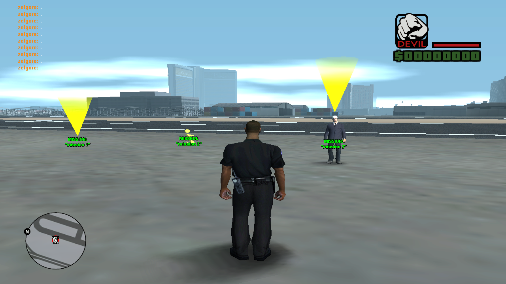
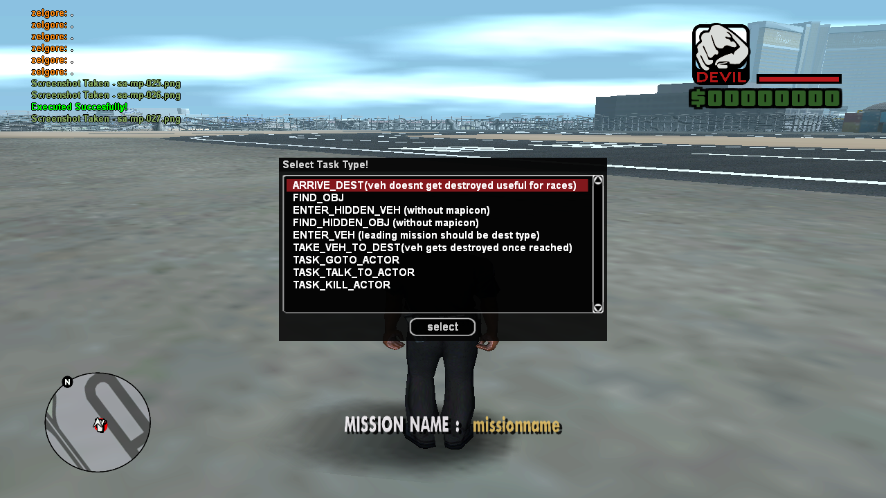
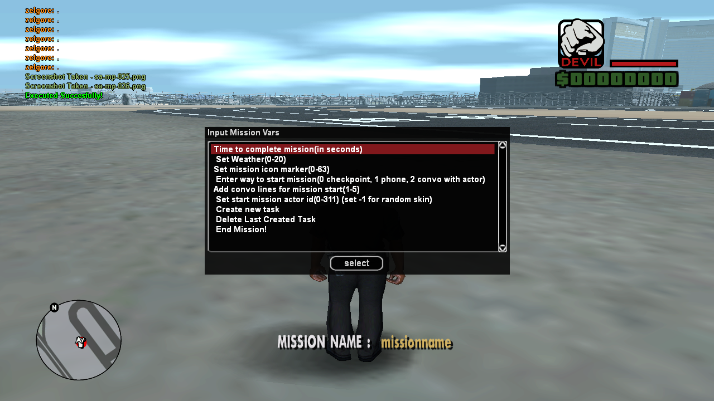
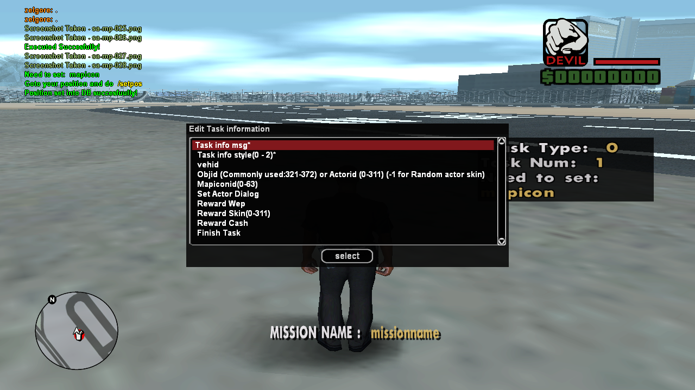

#  Do Your Own (M)issions (M)ulti Player

- Create missions similar to singleplayer and add them to your server with no extra code. The workflow is similar to texture studio, you create missions on a local server, the properties for the mission gets saved in dyomp.db, put the .db in your server scriptfiles folder and the dyomp.amx in the filterscript folder, that's it! The dyomp.amx reads the db values and handles player interaction with the mission on your server

- Required includes: Only Streamer for streaming objects, pickups, actors. Uses built-in sqlite for storing mission properties.

------------

## How it works

- Each mission consists of multiple tasks. Each task can vary from reaching a destination to killing an actor (softsided NPC). On each task completion, player could be rewarded uniquely with a skin, some cash or any weapon. After a task, another task can be added depending on the dev story choice for that mission. Combining these tasks, complex storyline missions could be created providing enthralling experience for players similar to singleplayer. Along with custom missions, exciting races and jobs could be created. Endless possibilities honestly.
The linear order of mission flow would be:
1. Player starts the mission
2. Mission values from the .db get loaded for the player and the first task values
3. Player completes the task and reward would be given.
4. Next task gets loaded 
5. Repeat from step 3 until there are no tasks left

- Mission only ends when all the tasks are completed (success status) or when the player disconnects or dies (failure status).

------------

## Available Task Types

- ARRIVE DEST -> Set a checkpoint for the player to get to (Note: Vehicle wont get destroyed if he arrived to the checkpoint through a vehicle).
- FIND_OBJ -> Set a position where an object of your choosing spawns as a pickup for player to pick up. 
- ENTER_HIDDEN_VEH -> Set a position where a vehicle spawns for player to get into but the vehicle won't be marked with an icon in the map for player. He has to find it himself.
- FIND_HIDDEN_OBJ -> Same as the above one but for a pickup.
- ENTER_VEH -> Set a position for a vehicle to spawn in with a mapicon for player to get into. 
- TAKE_VEH_TO_DEST -> After player gets into a hidden or visible vehicle, he can take it to destination by the position you set using task type. Useful for end checkpoints of races or delivering final items (NOTE: Vehicle gets destroyed when player reaches the checkpoint set using this task type).
- TASK_GOTO_ACTOR -> Set a position for an actor (NPC) to spawn. Task gets completed when the player gets near the actor. Useful for delivery like missions.
- TASK_TALK_TO_ACTOR -> Set a position for an actor (NPC) to spawn. You can set dialogs for the interaction between player and actor when player reaches this actor.
- TASK_KILL_ACTOR -> Set a position for an actor (NPC) to spawn. Player needs to kill the actor for the task to get completed.

------------

## Available Mission Properties 

- Choose the way how player starts the mission (checkpoint, phone pickup, talking with an NPC where you can set the dialog lines).
- For the actor type, you can set dialog lines when the player chooses to start the mission.
- Set weather when Player starts the mission.
- Set a timer for the mission to be completed within the timeframe. 
- Mapicon for the player to identify the mission location.

------------

## Available Task Properties (Applicable for every type of task)

- Set the info message player should be shown when the task starts. ex: Find the hidden briefcase around you!
- Set the way info message should be shown (0 - in chat, 1 -  white textdraw in bottom, 2 - right side in a black semi transparent box).
- Mapicon to specify location .
- Specific reward to be given on completion of task.

------------

## Video Showcase

- [Creating an example mission...](https://youtu.be/8UNPVs4YJrM "Creating an example mission")
- [Result of the Created Mission...](https://youtu.be/Vpf1ONG-0sA "Result of the Created Mission")

## Instructions

- Place the dyomp.amx in your filterscript folder
- Put the dyomp.db in your scriptfiles folder
- Add the dyomp filterscript in your server.cfg

## Where's the local server file to create the mission?

I have given out the dyomp.amx which detects the mission from the .db and adds them to your server. I'm willing to negotiate a price for the mission creation file (source code if needed) as I consider this tool can be a game changer since you can create custom singleplayer missions for your server in a matter of minutes which makes all the difference if you're in the rp scene. You can message me at discord ( dafted punk #3948 ).

